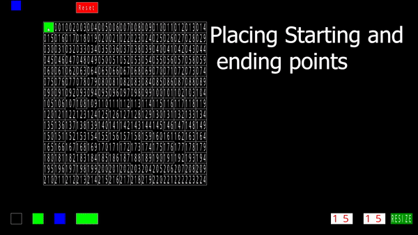
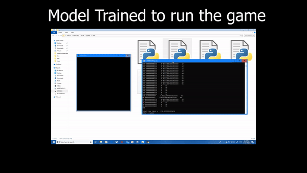

# Game-AI

### This project focuses on implementing existing artificial intelligence algorithms in games and providing a comparison of the used algorithms

## Game 1: Maze Game:
#### A typical maze game with customizable grids to block/allow passage from the starting point to the ending point.
Algorithms used : Breadth First Search , Depth First Search

## Game 2: T-REX Jump:
#### A 2-Dimensional platformer similar to the game that appears when chrome is not able to connect to the internet.
Algorithms used : Genetic Algorithm , Simulated Annealing

